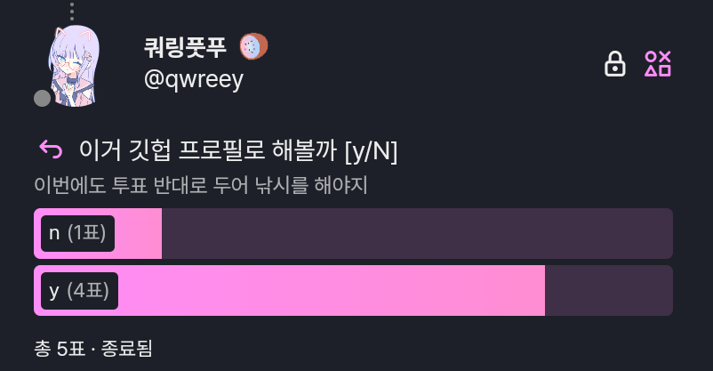

&lt;&lt; 님들이 원한거야

<!--   <a href="https://qwreey75.github.io/">
     
  </a> -->
  <h4>A common academic developer</h4>
  
🏳 they/them&nbsp;&nbsp;&nbsp;|&nbsp;&nbsp;&nbsp;🇰🇷 Native Korean Speaker&nbsp;&nbsp;&nbsp;|&nbsp;&nbsp;&nbsp;🐱 Love cats

  
🏳 Cisgenderless(Non-binary) Asexuality (Unclear)

<h3 align=center>:link: Links :link:</h3>

  <!-- <a href="https://qwreey75.github.io/"><kbd>&nbsp; &nbsp
  🏠 Homepage
  &nbsp; &nbsp;</kbd></a> -->
  <a href="https://extensions.gnome.org/accounts/profile/qwreey75"><kbd>&nbsp; &nbsp
  🔧 Gnome-Extensions
  &nbsp; &nbsp;</kbd></a>
  <a href="https://toss.me/qwreey75"><kbd>&nbsp; &nbsp
  💰 Toss
  &nbsp; &nbsp;</kbd></a>
  <!--<a href="https://stella.place/@qwreey"><kbd>&nbsp; &nbsp
  🪐 Fediverse
  &nbsp; &nbsp;</kbd></a>-->
<!--
  <a href="https://www.twitch.tv/qwreey"><kbd>&nbsp; &nbsp
  📽️ Twitch
  &nbsp; &nbsp;</kbd></a>
-->

<!--
<h3 align=center>🛠 Tech Stack 🛠</h3> 

TODO 이거 뱃지로 옮길래여 응애
관심 프로젝트 적기 (미스키)
<pre>
AKA 'console.log(cat == cute)'
version 17.0 beta
LANG : Lua Shellscript Java Html Css Javascript Python C C++ Go PowershellScript Typescript Moonscript
TOOL : Vscode Neovim Vim Nano Sublime-Text Visual-Studio Atom Intellij
TERM : BASH, ZSH(WITH OMZ, P10K)
OHTR : Windows Terminal
THEM : Dracula, Custom theme, Input Mono Font
INTR : FFmpeg, Discord, Electron, Luvit(Lua-node), Nodejs, WebPrograming, Youtube-dl, Nodejs, Mkdocs

Watch below for more informations
</pre>
-->

<h3 align=center>💥 모에로 승부보는 서비스 💥</h2>

kawaii services
 

<a href="https://paste.async.moe">paste.async.moe</a> - Pastebin alike code share service

<a href="https://status.async.moe">status.async.moe</a> - Service status of async.moe

<h3 align=center>📃 Banners 📃</h2>

  
  
   
  <!--
  
  
  -->

<!--
<h3 align=center>Repositories</h2> 
-->

<h3>💜</h3> 
<a href="https://github.com/ltlapy">@ltlapy</a>
<a href="https://github.com/caipira113">@caipira113</a>
<a href="https://github.com/pikokr">@pikokr</a>
<a href="https://github.com/SeodanLee">@SeodanLee</a>
<a href="https://github.com/star0202">@star0202</a>
<a href="https://github.com/wogud0501">@wogud0501</a>
<a href="https://github.com/xcvbwer123-rs">@xcvbwer123-rs</a>
<a href="https://github.com/seomin1210">@seomin1210</a>
<a href="https://github.com/rihayoru">@rihayoru</a>
<a href="https://github.com/ktttyctty">@ktttyctty</a>
<a href="https://github.com/jiwonz">@jiwonz</a>

<h3 align=center>▪️ ETC ▪️</h3>

<!--

  
시사평론

  
<b>차별 금지법, 학생 인권 조례 폐지는 있어선 안될 일이다.</b> 우리나라는 시대를 역행하고 있다. 부끄러운 일이다. 학생을 포함해, 모든 소수자는 사람으로써 사람이 마땅히 누릴 수 있는 모든 권리를 누려야한다. 그것이 정의고 국가가 가져야할 목표중 하나다. 소수자를 배척하고 배제하고자 하는 행위는 역사적으로 그릇됨이 명확히 제시되어있다. 그래선 안되는것이 명확하다

-->

  
의미가 있는지도 모르겠는 TODO

  <blockquote>
    todo: 돈벌어서+요리배워서 파링냥 맛있는거 먹이기 
    todo: 망해버린 블로그 심폐소생술 
    todo: 어제보다 더 나은 사람이 되기. 기계가 되지 말기
  </blockquote>

