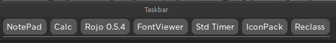
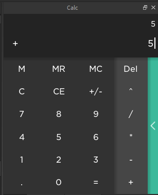

로블록스 개발은 주로 고등학교 야자 끝난 뒤 (밤 10시) 취미생활로 몇시간씩 투자하는식으로 진행했었기 때문에 대부분의 작품들이 짧은 시간내에 만들어낸 플러그인이 대부분입니다.
고 2 넘어가서는 웹개발과 리눅스 서버쪽을 깊게 다루게 되어 로블록스와 약간 멀어지긴 했지만, 로블록스 사람들에게(주변인) 여러 지식을 전파하고 로블록스 내부에서 사용할 수 있는 외부 api 를 만들고 서비싱하기도 하였습니다.
지금은 로블록스 측 사람들에게 개인 서버를 운영하며 컴퓨팅 자원을 제공하거나 조언을 제공하는 일을 하고 있습니다.

만든 작품들중 주요한것만 나열하면 이렇습니다.

# Plugins

qwreey's plugins 패키지로써 다운로드하게 되면 plugins 탭에 같이 묶여있게 됩니다.
주로 2020 2021 년도에 개발하게 되었습니다. 각각의 플러그인은 같은 라이브러리들을 사용해 만들어졌습니다.

모든 플러그인의 소스는 깃허브 repo 에서 확인하실 수 있습니다. [링크](https://github.com/qwreey/qwreey.roblox.plugins)

## Material Icons Plugin

Material Icons 에셋을 사용할 수 있게 해주는 간단한 플러그인입니다.
저의 [MaterialUI](https://sites.google.com/view/rbx-material-ui/component/button) 라이브러리로 작성되었으며 소스코드는 github 에서 공유됩니다

Roblox 공식 개발자 포럼에서 공개되었으며 14K 의 조회수를 가지고 있습니다. [링크](https://devforum.roblox.com/t/plugin-material-icons-1400/906640)

네이버 카페 '로블록스 스튜디오 개발자 커뮤니티' 에서도 공유되었습니다. [링크](https://cafe.naver.com/robloxstudio?iframe_url_utf8=%2FArticleRead.nhn%253Fclubid%3D30135743%2526articleid%3D1156)

## Font viewer

로블록스의 기본 폰트들을 나열해 보여주고 텍스트박스 등의 선택된 오브젝트의 폰트를 지정해주는 플러그인입니다.

네이버카페 '로블록스 스튜디오 개발자 커뮤니티' 에서 공유되었습니다 [링크](https://cafe.naver.com/robloxstudio?iframe_url_utf8=%2FArticleRead.nhn%253Fclubid%3D30135743%2526articleid%3D969)

## Taskbar

플러그인 윈도우들을 전환하는 플러그인입니다.

네이버카페 '로블록스 스튜디오 개발자 커뮤니티' 에서 공유되었습니다 [링크](https://cafe.naver.com/robloxstudio?iframe_url_utf8=%2FArticleRead.nhn%253Fclubid%3D30135743%2526articleid%3D1227)

## StdTimer

스튜디오 사용 시간을 기록해주는 플러그인입니다.

네이버카페 '로블록스 스튜디오 개발자 커뮤니티' 에서 공유되었습니다 [링크](https://cafe.naver.com/robloxstudio?iframe_url_utf8=%2FArticleRead.nhn%253Fclubid%3D30135743%2526articleid%3D980)

## Calc

계산기를 스튜디오에 구현한 플러그인으로써, 당시 구글의 Material 디자인을 따라 만들어졌습니다.

네이버카페 '로블록스 스튜디오 개발자 커뮤니티' 에서 공유되었습니다 [링크](https://cafe.naver.com/robloxstudio?iframe_url_utf8=%2FArticleRead.nhn%253Fclubid%3D30135743%2526articleid%3D1039)

---

이외의 다양한 창작물이 있지만, 배포가 되었으며 완성된 프로젝트가 얼마 없어 기제하지 않았습니다.
더 많은 창작물을 보고싶으시다면 네이버카페를 확인해주세요.

[네이버카페 프로필](https://cafe.naver.com/ca-fe/cafes/30135743/members/psGJUrjhoBPy4d1rYNPNcQ?tab=articles&page=3)

소개를 읽어주셔서 감사합니다.

